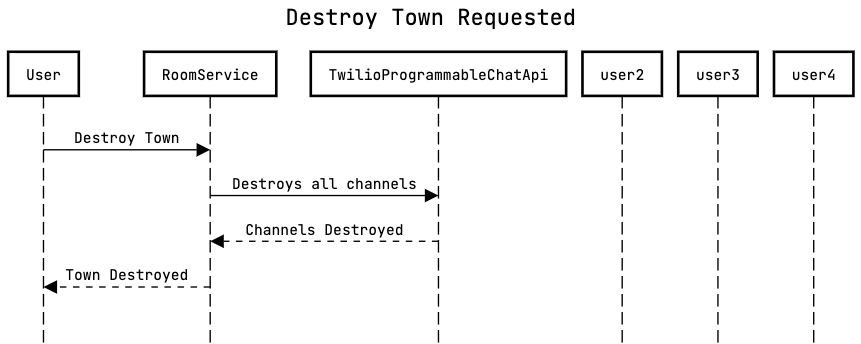
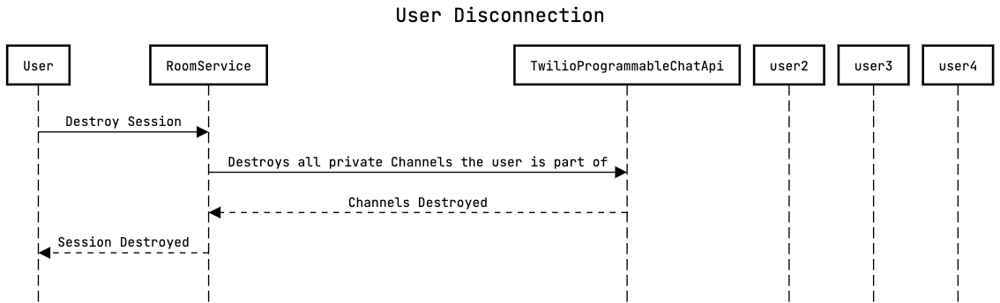

# Design

## Twilio Programmable Chat API Intro:

We have integrated the chat feature into Covey-Town application enabling users to chat with everyone in the town, a group of people and privately with each person. We have leveraged the Twilio Programmable Chat API to integrate the feature into the application. Some of the main concepts of Twilio Programmable Chat API are described below.

### Tokens and Chat Client:

To interact with Twilio Programmable Chat API we need a client. In order to create a Twilio Programmable Chat client, you will need an access token. This token holds information about your Twilio Account and Programmable Chat API keys. We have utilised the Twilio access token being generated for Video services and added ChatGrant to it along with VideoGrant. We can use the token to create Chat Client in the front end back end and interact with Twilio Programmable Chat API.

### Channel:

A Channel resource of Programmable Chat represents a chat room, which is a familiar concept for what is, programmatically, a scope in which messages can be sent and received by its members. Members can be added or invited to join channels. Each channel has a ‘sid’ property unique string that uniquely identifies the Channel resource. Using Chat Client we can retrieve the channel with a ‘sid’, Create a channel,Join a Channel, Leave a channel and delete a channel.

### Channel Listeners:

As mentioned above we can send messages, receive messages,join and leave channels. We can add listeners to channels to respond to events in the channel. We have added listeners to channels in the front end to update the UI based on the changes in the channel mainly for ‘messageAdded’ events.

## Implementation and Changes:

To maintain consistency of channel and avoid duplicate channel creation we have consolidated the channel creation in the backend. In the front end we have three separate chat components for each chat type.

Please find the flows and design we have followed to for different chats

## Broadcast Chat:

Each town has a broadcast chatting component which allows users to send messages to everyone in a town. We have modified code in ‘CoveyTownController’ to create a Twilio Chat channel when a new town is created and whenever a player joins a town we return the Broadcast channel SID in the response to the front end along with Twilio Token. BroadcastChat component creates a ChatClient with Twilio token and retrieves the channel from Twilio Programmable Chat API with Broadcast channel SID and joins the channel. We add a listener for ‘messageAdded’ events on the channel to update the messages in the Broadcast chat component. Users can send to and receive messages from everyone in the room by sending message on this channel as all user would be joining this channel.

## Group Chat:

Each town has a highlighted area where a group people can gather to receive and send messages to people in that area. We have modified code in ‘CoveyTownController’ to create a Twilio Chat channel when a new town is created and whenever a player joins a town we return the Group chat channel SID in the response to the front end along with Twilio Token. In the front end whenever a user enters the group chat area we globally update a react state which triggers a use effect in GroupChat Component to retrieve the Group chat channel from Twilio Programmable Chat API using Chat client and join the channel. We add a listener for ‘messageAdded’ events on the channel to update the messages in the Group chat component. When the player travels out of the group chat area, we remove the added listeners and leave the group chat channel.

Note: When a town delete request is made, we have added code in CoveyTownController 'disconnectAllPlayers' to interact with Twilio Programmable Chat API to destroy Broadcast and Group Chat channels.

## Private Chat:

This feature enables users to message any person in the town privately. We designed the private chat in a way that a channel is created for a pair of users on demand when a user initiates a chat with another user. In the front end we maintain a state of all the Twilio channels used for private messaging to other users. When a user wants to chat with another person for the first time, Private chat component makes a request to the backend with another person's userID,coveyTownID. We have added a Rest endpoint ‘/privateChannel’ in the backend used to create Twilio chat channels on demand.In CoveyTownListener we have added an attribute playerId and a function 'onNewPrivateMessageRequest'. We maintain a map of userIds and channels created by each user in Coveytown controller. We have added a function ‘createPrivateChannel’ in CoveyRequestHandler to handle requests which retrieves CoveyTownController based on coveyTownID in the request. We make a call to ‘createChannel’ in the CoveyTownController to create a Twilio chat channel and update the channels in the map maintained by Covey town controller. Once the channel is created we return the channel ‘sid’ to the requestor. We filter the listener of the player that the requestor wants to message in CoveyTownController and call ‘onNewPrivateMessageRequest’ of the listener with the channel sid and the requester user id. This results in emitting ‘messageRequest’ on the socket of the user with the channel ‘sid’. In the front end both the users Privatechat component receives the channel ‘sid’. We retrieve channel from Twilio Programmable Chat API using Chat client ,join the channel and set it as the current channel for the requester. We add a listener for ‘messageAdded’ events on the channel to update the messages or the unread message count in the Private chat component. If a user already has interacted with the person we use the state to retrieve the channel, retreive messages for the channel from Twilio API messages in the channel and set it as the primary channel in the component.

When a player leaves the room we have updated the ‘destroySession’ function in CoveyTownController to delete the channels created by that user.

## CRC Cards

CRC cards for the classes modified can be found [here](docs/crc-cards.pdf)
