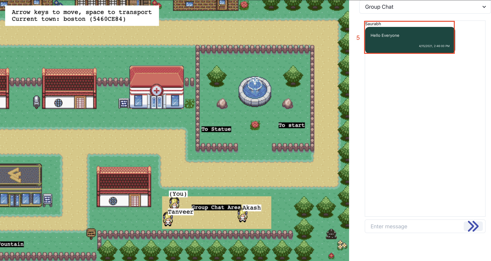

# Features of Our Project

This file contains contains documentation for a user to interact with out updated version of Covey.town. It covers all steps that the user would need to take to exercise all of our user stories.

### User Story 1 - Chat with everyone in the same town

This user story allows the users to communicate with other users in the same Covey Town using the Broadcast Chat functionality. The steps to use this feature are:

1. After joining a town, the user will see the Chat area on the right side of the screen. There is a drop-down on the top-right hand side showing the current chat type selected. By default, it will be ‘Broadcast Chat’.
2. To enter a message, the user needs to type in a message in the input box which says ‘Enter Message’.

3. Press ‘Enter’ or click on the icon right next to the input box to send the message. 
4. After sending the message, all the users in that Covey.town will be able to see that particular message that the user just sent. 

5. Messages sent by anyone in the town using broadcast chat will appear in the chat area.

### User Story 2 - Private Group chat in a designated area in the town

This user story allows users to gather in a designated area and start a private group chat among themselves. The steps to use this feature are:

1. After joining a town, the user will see the 'Broadcast Chat' dropdown on the top-right hand side of the screen. Click on it to select 'Group Chat' option. You should something like -

2. After entering the designated area (labelled as 2 in the below image), the user should see that the group chat section is now displayed on the right hand side of the screen. The user can type in the message in the input box (labelled as 3 in the below image) and click the send button (labelled as 4 in the below image) or press 'Enter' key to send the message.

3. This message will then be sent to all the users present in the group chat area.

4. In the below image, we can see that 'Tanveer' can see the message sent by Saurabh on his screen, since Tanveer is present in the Group Chat Area.

5. We can see that the message sent by Saurabh is not visible to the user (labelled as 6 in the below image) since, they are not present in the group chat area.

 

### User Story 3 - Private message other users in the same town

This user story allows users to privately message other users in the Covey.town. The steps to use this feature are:

1. After joining a town, the user will see the 'Broadcast Chat' dropdown on the top-right hand side of the screen. Click on it to select 'Private Chat' option. You should something like -

2. From the 'Select Player' dropdown, the user can select the other user's name to which they need to private chat with. (In the below image, user selected 'Tanveer'). The user can type in the message in the input box (labelled as 3 in the below image) and click the send button (labelled as 4 in the below image) or press 'Enter' key to send the message.

3. The user can see that their message is now sent to the other user.

4. The other user (Tanveer in the image below) can see that the select player drop-down now shows a number in front of the user's name. Earlier it was 0 since no message was sent but after getting a message, it changes to notify the user about the number of messages from other user. In the image below, Tanveer can see that Saurabh has sent them a private message which can be viewed by clicking on the user's name from the drop-down.

5. After clicking on the user's name from the drop-down, the receiver is shown the message that was sent. (in the image below, Tanveer can see the message from Saurabh, in the chat area)

6. None of the other users will be a part of the conversation and hence will not be able to see any messages that are sent between the two users since it is a private channel.

